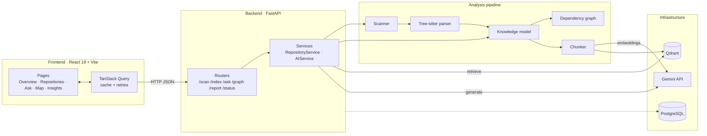
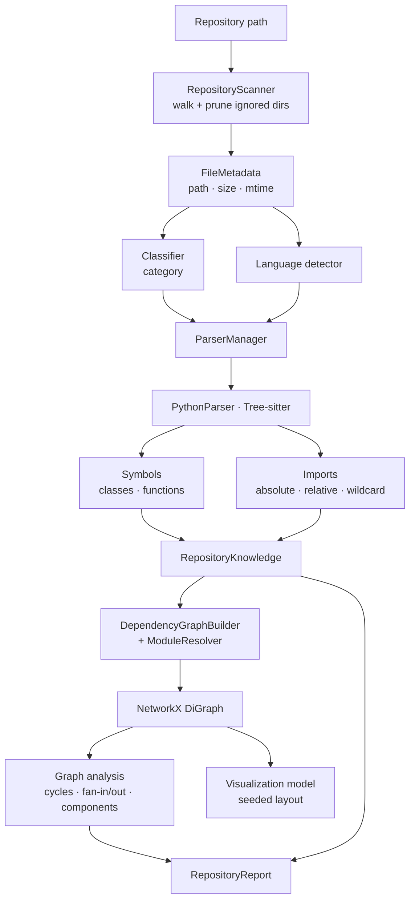
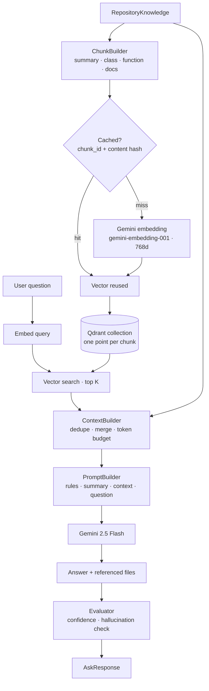
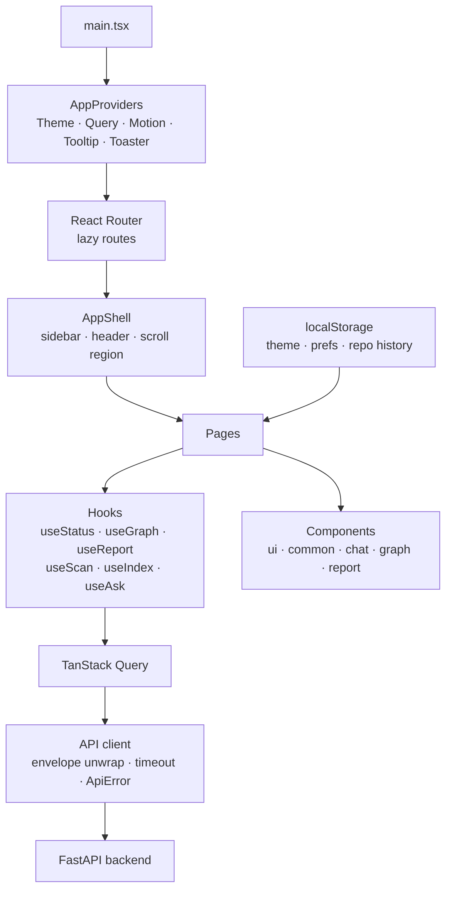

# CodeAtlas

Point CodeAtlas at a local repository and it maps the codebase: file
structure, symbols, imports, a dependency graph, an architecture report —
and then answers questions about the code with citations back to the files
it read.

Every answer carries a confidence score and the list of files it was
grounded in, so you can check the work.

<!-- Add a hero screenshot here: docs/screenshots/overview.png -->

---

## The problem

Joining an unfamiliar codebase is slow. The questions you need answered
first — *where does execution start, what depends on what, which files
matter* — are answered by reading a lot of code, and general-purpose
chatbots answer them by guessing, with no way to tell a real answer from a
plausible one.

CodeAtlas takes the opposite approach: parse the repository first, build a
structural model of it, and let the model answer **only** from code it has
actually read. If the retrieved context does not support an answer, it says
so, and the evaluation layer flags it.

## Features

**Repository analysis**
- Recursive scanning with sensible ignore rules (`.git`, `venv`,
  `node_modules`, build output)
- File classification (source, test, config, docs, data, …) and language
  detection from paths alone
- Tree-sitter parsing of Python: top-level classes, functions, and every
  import form including relative imports
- Dependency graph with a module resolver that separates first-party
  imports from stdlib and third-party
- Graph analysis: cycles, fan-in/fan-out, roots, leaves, isolated files,
  connected components, density
- Engineering report with rankings and flagged issues, exportable as
  Markdown

**Question answering**
- Deterministic chunking (file summaries, classes, functions, docs by
  heading) with stable content-hashed IDs
- Gemini embeddings indexed into Qdrant, with a local cache so unchanged
  chunks are never re-embedded
- Semantic retrieval with language / chunk-type / path filters
- Context assembly under a token budget — whole chunks are skipped, never
  truncated
- Answers from Gemini 2.5 Flash, constrained to the supplied context
- Heuristic evaluation: 0–100 confidence, hallucinated-path detection, and
  diagnostic warnings — no second LLM call

**Interface**
- Dependency map with search, neighbour highlighting, and a file inspector
- Insights page with distributions, coupling rankings, and issue lists
- Chat with conversation history, retry, copy, and cited files
- Dark and light themes, keyboard shortcuts, reduced-motion support

## Architecture



### Repository analysis pipeline



### RAG pipeline



### Frontend architecture



## Tech stack

| Layer | Choices |
| --- | --- |
| Backend | Python 3.12, FastAPI, Pydantic v2, Uvicorn |
| Parsing | Tree-sitter (`tree-sitter-python`) |
| Graph | NetworkX |
| AI | Gemini 2.5 Flash (answers), `gemini-embedding-001` (768-d embeddings) |
| Vector store | Qdrant |
| Database | PostgreSQL (provisioned; reserved for persistence work) |
| Frontend | React 19, Vite, TypeScript, Tailwind CSS v4, shadcn/ui |
| Data layer | TanStack Query, React Router |
| Visualisation | React Flow, Recharts, Framer Motion |
| Testing / tooling | pytest (409 tests), Ruff, oxlint |

## Screenshots

See [docs/screenshots.md](docs/screenshots.md) for the full shot list.

| View | File |
| --- | --- |
| Repository Overview | `docs/screenshots/overview.png` |
| Dependency Map | `docs/screenshots/graph.png` |
| Ask CodeAtlas | `docs/screenshots/chat.png` |
| Repository Insights | `docs/screenshots/insights.png` |

## Installation

**Prerequisites:** Python 3.12+, Node.js 20+, Docker Desktop, and a
[Gemini API key](https://aistudio.google.com/apikey).

```bash
git clone <repository-url> CodeAtlas
cd CodeAtlas
```

### Configuration

```bash
cp .env.example .env        # PowerShell: Copy-Item .env.example .env
```

Set `GEMINI_API_KEY` in `.env`. Everything else has a working local
default:

| Variable | Purpose |
| --- | --- |
| `GEMINI_API_KEY` | Required for `/index` and `/ask` |
| `CODEATLAS_LOG_LEVEL` | Backend log level (default `INFO`) |
| `POSTGRES_*` | Container credentials and host port |
| `QDRANT_HOST` / `QDRANT_HTTP_PORT` | Vector store connection |

### Docker

Starts PostgreSQL and Qdrant with named volumes and health checks:

```bash
docker compose up -d
docker compose ps          # both should report (healthy)
```

### Backend

```bash
cd backend
python -m venv venv
./venv/Scripts/Activate.ps1     # macOS/Linux: source venv/bin/activate
pip install -r requirements.txt
uvicorn main:app --reload
```

API on `http://127.0.0.1:8000`, interactive docs at `/docs`.

### Frontend

```bash
cd frontend
npm install
cp .env.example .env.local
npm run dev
```

UI on `http://localhost:5173`.

### Running locally

With all three running, open the UI and:

1. **Repositories** — paste an absolute path on the backend machine, then
   **Scan repository**.
2. **Index for questions** — chunks and embeds the code. Re-running only
   embeds what changed.
3. **Ask CodeAtlas** — ask about the code; answers cite their sources.
4. **Dependency Map** / **Insights** — explore structure and metrics.

> On the Gemini free tier, embedding requests are rate-limited. Large
> repositories may report partial indexing; re-run indexing and cached work
> is reused.

## API overview

Every endpoint returns the same envelope:

```json
{ "success": true, "data": { }, "error": null, "message": "" }
```

| Method | Path | Purpose |
| --- | --- | --- |
| `GET` | `/health` | Liveness check |
| `GET` | `/status` | Version, uptime, infrastructure, AI config, cache stats |
| `POST` | `/scan` | Analyse a repository; optional graph and report summary |
| `POST` | `/index` | Chunk, embed, and index into Qdrant |
| `GET` | `/graph` | Draw-ready nodes, edges, and graph statistics |
| `GET` | `/report` | Full architecture report |
| `POST` | `/ask` | Retrieval-grounded answer with confidence and citations |

Errors use the same shape with a machine-readable code
(`invalid_repository_path`, `validation_error`, `embedding_failed`,
`answer_generation_failed`, `internal_error`). Stack traces are never
returned. Full details: [docs/api_overview.md](docs/api_overview.md).

## Project structure

```
CodeAtlas/
├── backend/
│   ├── ai/            # Prompt construction and Gemini answer generation
│   ├── api/           # Routers, schemas, response envelope, DI
│   ├── chunking/      # Chunk models and builder
│   ├── config/        # Pydantic Settings
│   ├── context/       # Context assembly and token budgeting
│   ├── embeddings/    # Provider, cache, Qdrant store, indexer
│   ├── evaluation/    # Confidence scoring and diagnostics
│   ├── graph/         # Graph build, resolver, analysis, visualisation
│   ├── knowledge/     # Unified repository knowledge model
│   ├── parsers/       # Tree-sitter parsing, symbols, imports
│   ├── reports/       # Report generation and Markdown export
│   ├── retrieval/     # Semantic search over Qdrant
│   ├── scanner/       # Discovery, classification, inventory
│   ├── services/      # Orchestration behind the API
│   └── main.py
├── frontend/src/
│   ├── components/    # ui · common · layout · chat · graph · report
│   ├── hooks/         # API bindings and local state
│   ├── lib/           # API client, formatting, report export
│   ├── pages/         # One file per route
│   └── providers/     # Theme, Query, Motion
├── docs/              # Architecture, API, demo, screenshots, resume
├── examples/          # Runnable pipeline scripts
├── tests/             # 409 pytest tests
└── docker-compose.yml
```

## Testing

```bash
backend/venv/Scripts/python.exe -m pytest tests -q   # 409 tests
backend/venv/Scripts/python.exe -m ruff check backend examples tests
cd frontend && npm run build && npm run lint
```

Unit tests never call the Gemini API and run Qdrant in memory, so the suite
needs no containers and no API key.

## Future improvements

- **More languages.** The parser framework dispatches by language and
  Tree-sitter has grammars for most of them; only the Python parser is
  implemented.
- **Persistence.** PostgreSQL is provisioned but unused — scan history and
  saved conversations are the obvious first tenants.
- **Incremental indexing.** Chunk IDs are content-hashed, so re-indexing
  only changed files is a matter of diffing against what Qdrant holds.
- **Streaming answers.** The backend generates in one shot; token streaming
  would improve perceived latency.
- **Symbol-level graph.** The graph is file-level today; the parser already
  extracts symbols to support a finer-grained view.
- **Retrieval evaluation set.** A fixed question set with expected sources
  would turn the heuristic scorer into a regression test.

## License

MIT — see [LICENSE](LICENSE).
