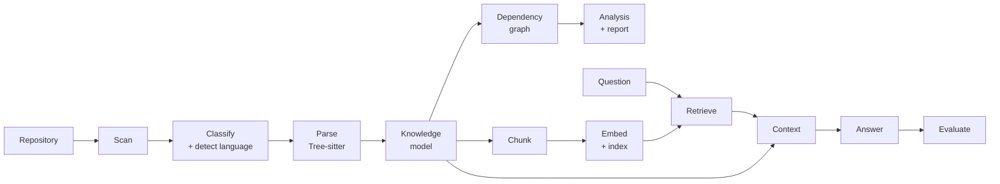

# Architecture

CodeAtlas turns a local repository into an explorable, queryable knowledge
base. The backend is a pipeline of small, independent Python packages under
`backend/`, exposed through a FastAPI service layer. Each stage consumes the
previous stage's typed output (Pydantic models throughout) and can be used
standalone.



Module dependencies run in one direction only — `scanner` knows nothing
about `parsers`, `parsers` nothing about `graph`, and no pipeline module
imports anything from `api` or `services`:

```mermaid
flowchart TD
    scanner --> parsers
    parsers --> knowledge
    scanner --> knowledge
    knowledge --> graph
    knowledge --> chunking
    graph --> reports
    chunking --> embeddings
    embeddings --> retrieval
    retrieval --> context
    knowledge --> context
    context --> ai
    ai --> evaluation
    retrieval --> evaluation

    services["services<br/>orchestration"]
    api["api<br/>routers"]
    api --> services
    services --> knowledge
    services --> graph
    services --> reports
    services --> embeddings
    services --> ai
    services --> evaluation
```

## Scanning (`scanner/`)

`RepositoryScanner` walks a repository with `pathlib`, pruning ignored
directories (`.git`, `venv`, `node_modules`, …) before descending, skipping
symlinks and ignored file patterns. It collects metadata only — contents are
never read. Each file is classified into a `FileCategory`
(`classifier.py`: source code, configuration, documentation, test, …) and a
`ProgrammingLanguage` (`language.py`), both from path/name rules alone.
`inventory.py` aggregates a `ScanResult` into distributions, largest files,
and per-directory statistics.

## Parsing (`parsers/`)

A language-dispatched framework: `ParserManager` routes each file to the
parser registered for its language and never raises — unsupported languages
and parser crashes become typed `ParseResult` statuses. `PythonParser` uses
Tree-sitter (`tree-sitter-python` grammar): it validates syntax (with error
line/column from the first error node), extracts **top-level** classes and
functions (`symbols.py`), and all import statements including relative
imports (`imports.py`). Syntax trees are kept inside the parser and are
never serialized.

## Knowledge (`knowledge/`)

`KnowledgeBuilder` merges scan metadata, parse results, and the inventory
into one `RepositoryKnowledge`: a list of `CodeFile` objects (metadata +
parse status + symbols + imports) plus repository totals. This is the
canonical, JSON-serializable representation the rest of the system consumes.

## Graph (`graph/`)

`DependencyGraphBuilder` creates a NetworkX `DiGraph`: every file is a node
(carrying its `CodeFile`), and edges connect importers to imported files.
`ModuleResolver` maps absolute and relative Python imports to repository
files; standard-library imports are skipped and everything else that fails
to resolve is reported as `unresolved_imports` (third-party packages land
there). `analysis.py` computes cycles, fan-in/out, roots/leaves/isolated
files, components, and density. `visualization.py` produces draw-ready
nodes/edges with deterministic `spring_layout` positions (fixed seed).
`reports/` renders knowledge + graph + analysis into a human-readable
`RepositoryReport` with Markdown and JSON export and configurable issue
thresholds.

## Chunking (`chunking/`)

`ChunkBuilder` splits the repository into embeddable `Chunk`s: per Python
file a deterministic FILE_SUMMARY, one CLASS chunk per top-level class, one
FUNCTION chunk per top-level function, and a MODULE fallback when a file has
no symbols; Markdown files split into DOCUMENTATION chunks by heading.
Chunk ids are SHA-256-derived from stable coordinates, so identical inputs
always produce identical ids. Token counts use a deterministic ~4
characters/token estimate.

## Embeddings & Indexing (`embeddings/`)

`EmbeddingProvider` is the abstraction; `GeminiEmbeddingProvider` implements
it with `gemini-embedding-001` at 768 dimensions. `IndexBuilder` batches
requests, retries transient failures with exponential backoff, and skips
chunks whose embedding is already cached (`EmbeddingCache`, keyed by chunk
id + content hash, persisted to JSON). `QdrantVectorStore` creates
collections on demand (cosine distance) and upserts one point per chunk with
a 13-field payload; point UUIDs are deterministic, so re-indexing updates
rather than duplicates.

## Retrieval (`retrieval/`)

`SemanticRetriever` embeds the query with the same provider, searches the
Qdrant collection, and returns the top-K hits ordered by similarity, with
optional filters (language, chunk type, relative path) and a score
threshold. A missing collection yields an empty result, never an exception.

## Context (`context/`)

`ContextBuilder` joins retrieval hits back to full chunk content (via the
deterministic ids), deduplicates, groups chunks into prioritized sections
(repository summary → files → classes → functions → documentation →
additional), merges contiguous same-file chunks, and enforces a token
budget by skipping whole chunks — content is never truncated.

## Answer Generation (`ai/`)

`PromptBuilder` assembles system instructions (answer only from context,
never invent code, admit unknowns, cite files, explain reasoning), the
repository summary, the retrieved context, and the user question.
`GeminiProvider` calls `gemini-2.5-flash`; `AnswerGenerator` adds retries
with backoff and packages an `AIResponse` with token estimates and the
context files the answer actually references.

## Evaluation (`evaluation/`)

`AnswerEvaluator` scores each answer heuristically (no second LLM call):
retrieval strength, context size, grounding ratio, and a hallucination check
for file paths not present in the context combine into a documented 0–100
confidence score, with human-readable warnings for empty retrieval,
insufficient context, budget overruns, and suspected hallucinations.

## API (`api/`, `services/`, `main.py`)

Routes are thin: `RepositoryService` (scan/knowledge/graph/visualization/
report/index) and `AIService` (retrieve/context/answer/evaluate/ask) do all
orchestration and are dependency-injected, so tests swap providers and the
Qdrant client freely. Every endpoint returns the shared envelope
`{success, data, error, message}`; exception handlers standardize error
responses and never expose stack traces. `services/self_check.py` provides
an internal pass/fail health probe across all subsystems.
